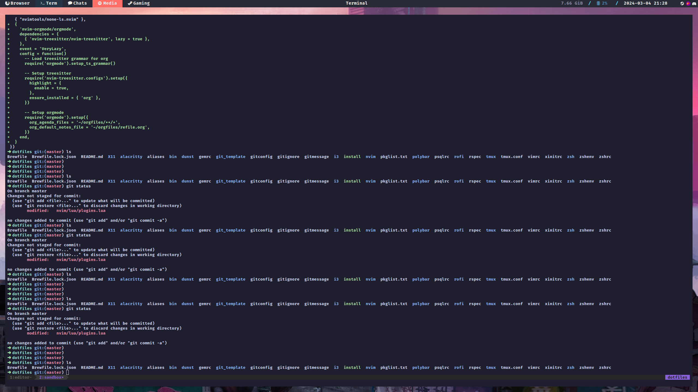

  

  # dotfiles
  My dotfiles for Mac and Linux (NixOS btw)

## Requirements

* Nix
* mac or NixOS
    *  only Nvidia and AMD hardware supported on NixOS

## Current state

I'm still in process of testing Nix. Everything is in constant flux.

I've tried to split everything into commits with decent messages. It's probably
best if you shift through the commits to learn more.

Don't blindly copy this repository and try to install. I will force push from
time to time and break stuff often.

## Guidelines

Some guidelines for configuration:

1. Be explicit! If that means copying the same `pwd` command a thousand times
   then so be it.

2. Simple problems should have simple solutions! We're provisioning machines not
   trying to fly to fucking Mars...

4. Remember that when you need to install these it's usually not because
   it's a sunny afternoon and you have all the time in the world. You'll
   install these when there are deadlines coming and your laptop decided
   to kill itself.

   So make these scripts with this in mind. When all you have is time, then
   you could make these in assembly and still have fun.

   But sadly that is fiction.

## What did you use before Nix

Over 10 years ago, I used
[laptop](https://github.com/UncertainSchrodinger/laptop). During or after which,
I experimented with rcrc. I dropped it after I got a new machine and had
forgotten how it worked.

Eventually I migrated to plain ass bash script for symlinking dotfiles. Check
commit `4f63efd8bc8dbec8913ed7e9fcbe6e89c81f6d10` for the last working version
of that.

### License

Wallpapers are not made by me. I have already forgotten where I got them.
