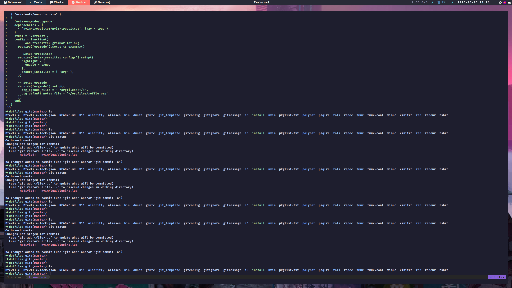

<div align="center">
  

  # dotfiles
  My NixOS (btw) configuration
</div>

## Supported hardware

* Intel or Nvidia GPU
* Intel or AMD CPU

## Current state

It's stable and used as a daily driver.

I've tried to split everything into commits with decent messages. It's probably
best if you shift through the commits to learn more.

## Usage

Update dependencies:

```bash
nix flake update
```

Update NixOS system:

```bash
sudo nixos-rebuild switch --flake .
```

## Features

* hyprland
* terminal based workflows
* neovim
* ai sandboxing

### AI Sandbox - aisabox

The script `aisabox` can be used to launch a sandboxed claude-code instance.
Sandboxing is done using a Qemu virtual machine, making it safe to allow Claude
to execute tools automatically.

The command works without any arguments but you can configure it in two ways:
`vm.nix` either at `$PWD` or given as flag `-c`, `flake.nix` output
configuration.

```nix
# vm.nix
{ pkgs, ... }: {
  claude-vm = {
    user = "youruser";
    uid = 1000;
    # shell = pkgs.zsh;
    # memory = 4096;
    # cores = 4;
    # enableIdeForward = false;
    # idePort = 61022;
  };

  # claude-vm.extraPackages = with pkgs; [
  #   rustc cargo clippy rust-analyzer
  #   nodejs_22 npm
  #   go gopls
  # ];

  # nixos-shell.mounts.extraMounts = {
  #   "/data" = {
  #     target = /path/to/shared/data;
  #     cache = "none";
  #   };
  # };
}
```

```nix
# flake.nix
{
  inputs = {
    nixpkgs.url = "github:NixOS/nixpkgs/nixpkgs-unstable";
    flake-utils.url = "github:numtide/flake-utils";
  };

  outputs =
    {
      self,
      nixpkgs,
      flake-utils,
    }:
    flake-utils.lib.eachDefaultSystem (
      system:
      let
        pkgs = import nixpkgs { inherit system; };
      in
      {
        devShells.default =
          with pkgs;
          mkShell {
            packages = [ ];
          };
      }
    )
    //
      {

        claude-vm =
          { pkgs, ... }:
          {
            claude-vm.user = "youruser";
            claude-vm.uid = 1000;
            claude-vm.extraPackages = with pkgs; [
              lolcat
            ];
          };
      };
}
```

When run, `$PWD` is mounted inside the VM with RW permissions. Root `.git`
directory is remounted as read-only to make sure the AI doesn't accidentally
destroy your local repository.

Claude is initialized with some defaults like skipping the default init
questions. After login, unless you've already done it once, you should be able
to just start prompting.

This also exposes ports for $EDITOR integration. But I have not yet verified
those to work.

## Repo history

Over a decade ago, I used
[laptop](https://github.com/UncertainSchrodinger/laptop). During or after which,
I experimented with [rcm](https://github.com/thoughtbot/rcm). I dropped it after
I got a new machine and had forgotten how it worked.

Eventually I migrated to plain ass bash script for symlinking dotfiles. Check
commit `4f63efd8bc8dbec8913ed7e9fcbe6e89c81f6d10` for the last working version
of that. These scripts were daily driven on work use in Mac and Linux systems.

## Art

Sadly, I do not remember which artists made the wallpapers I use.
